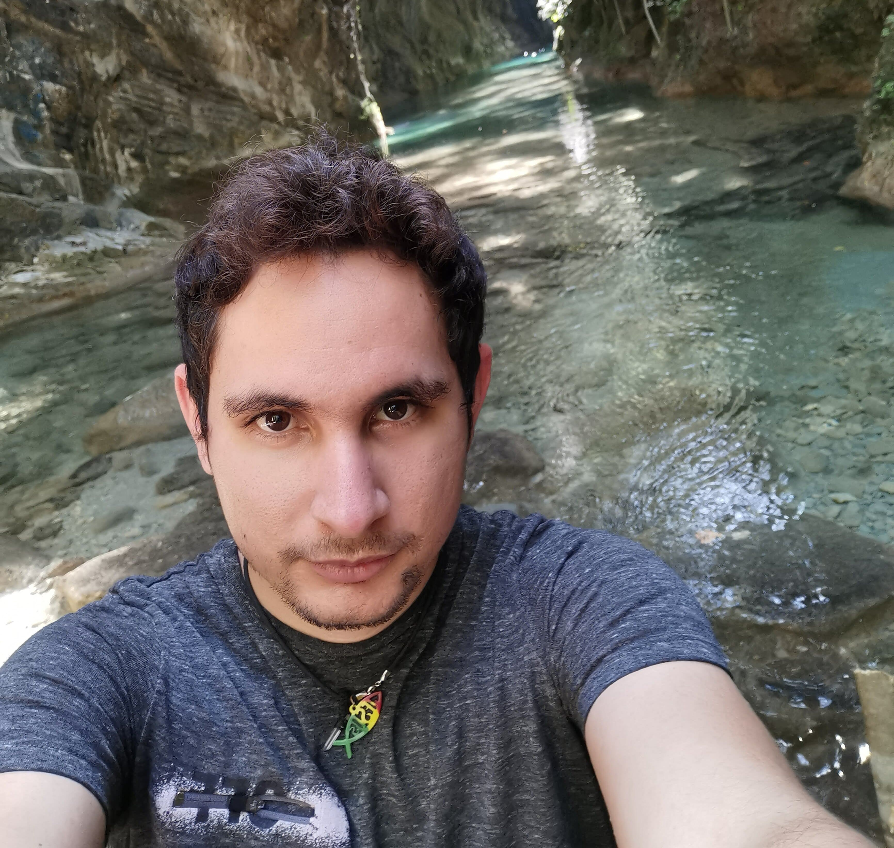
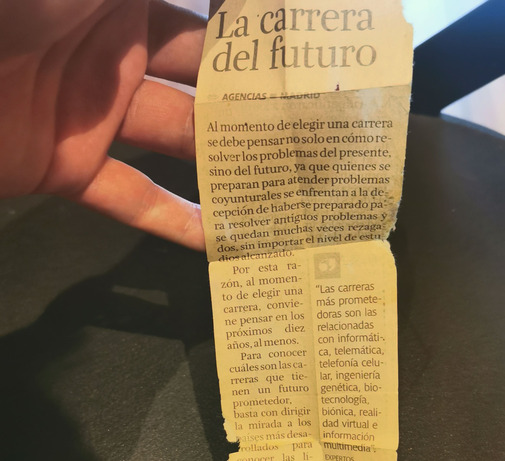

> Todos los días Dios nos da un momento en que es posible cambiar todo
> lo que nos hace infelices. El instante mágico es el momento en que
> un **sí** o un **no** pueden cambiar toda nuestra existencia. - **Paulo Coelho**

Me llamo Keryc Díaz, me consideran un Ingeniero de Software. Así es, **me consideran**, ya que no poseo un certificado que lo confirme.

**Mi objetivo es enseñarte a tener las habilidades para tomar buenas decisiones en cualquier acción que te propongas, sin importar que profesión tengas.**

## **¿Como puedo ayudarte?**

---

Si eres Ingeniero aprenderás sobre arquitectura de software, sistemas escalables, microservicios, y uno que otros tutoriales. **_¿NO LO ERES? NO TE PREOCUPES_** aquí veras historias reales basadas en mi propia experiencia personal. **_SIN CIENCIA FICCIÓN_**. Lo que encontraras es un conjunto de decisiones por las que tuve que pasar para **llegar a donde estoy**.

Tanto tú como yo tomamos decisiones diariamente. Algunas son simples y otras requieren valentía. Solo debes tener en cuenta que eres el resultado de las decisiones tomadas en el pasado. ¿Quieres verte bien en el futuro?. **¡Empieza a tomar decisiones hoy!**

## **Mi historia personal**

---

> **Keryc'** no se considera un nombre, se conoce como un apellido
> y fue el resultado de una completa **_casualidad_**. Mi hermano mayor
> tiene el nombre Kenyc y cuando yo nací, mis padres tuvieron
> las gran idea de solo cambiarle solo un letra.

Nací en <a href="https://es.wikipedia.org/wiki/Maracaibo" target="_blank">la tierra del sol amada</a>, ciudad que tiene por nombre **Maracaibo** la cual se ubica en Venezuela y se caracteriza por tener un clima muy cálido todo el año.

El crecimiento personal y laboral me fue llevando por distintos rumbos hasta detenerme en Ciudad de México. Aquí desempeño el cargo de **Ingeniero de Software** en una Fintech (Industria Financiera).

Mi vida ha pasado por distintas etapas y decisiones que he tenido que tomar para llegar en este punto de la historia, permíteme contarte un poco más.

## **Mis más grandes decisiones**

---

### 1.- Dejar el trabajo de familia y dedicarme a lo que le veía futuro.

Mi papa era **Electricidad Automotriz** y como casi todo niño yo quería ser como él. Él fallece a mis 5 años pero mi objetivo ya estaba muy claro. Es por esto que me dedique a aprender junto a la persona que mi padre enseño y así estuve 3 años hasta que un día llego a mis manos lo que verás a continuación:

`No recuerdo el día exacto, pero este periódico es de entre 2012 y 2013`

Desde ese momento entro a mi cabeza, **ESTE ES EL FUTURO** y aun estando en escuela segundaria empece a adentrarme en el desarrollo web. 😅<a href="https://hipertextual.com/2016/01/hello-world-origen" target="_blank">¡Hola mundo!</a>😅

### 2.- Dejar la universidad y aprender 100% autodidacta.

Entro a la universidad, quede seleccionado para estudiar lo que yo más quería **Licenciatura en Computación**. Con mucho esfuerzo llego al 5º semestre y así estuve hasta que por la situación del país, la universidad entra en **PARO INDEFINIDO**.

Allí fue donde dí mis primeros pasos en el aprendizaje autodidacta:

- Empece a tomar cursos en <a href="https://www.codecademy.com/" target="_blank">codecademy</a> cuando esta plataforma erá gratis.
- Me leí y puse en práctica completamente <a href="https://gutl.jovenclub.cu/wp-content/uploads/2013/10/El+gran+libro+de+HTML5+CSS3+y+Javascrip.pdf" target="_blank">El gran libro de HTML5 CSS3 y Javascript</a>
- Acepte desarrollar proyectos web sin ni siquiera saber como hacerlos y casi sin cobrar dinero **SOLO POR APRENDER**

Finalmente luego de 1 año cuando la universidad decidió retomar las clases, decidí **no volver a ella** y crecer más en mi carrera de forma autodidacta, aprendiendo de nuevas tendencias constantemente.

### 3.- Viajar a Colombia por necesidad para luego viajar por oportunidad.

El crecimiento fue exponencial, me encontraba realizando proyectos web freelancer más complejos. Muchos de estos provenían de cuentas online para trabajo remoto y otros eran referidos de clientes. Todo iba bien hasta que **surge un inconveniente.**

La comida empieza a escasear en Venezuela lo cual me obliga a tener que viajar por tierra a Colombia, comprarla y volver a mi país. **¡MI PRIMERA VEZ FUERA DEL PAÍS!** No era nada sencillo, pero la necesidad lo requería. Luego de varios viajes agotadores y ganas de no continuar decidí iniciar a postularme en empresas Colombiana. Rápidamente una me contacto para un puesto de desarrollador.

En este momento empieza una travesía que espero contarle en un artículo más adelante, pero para resumirlo, tome la decisión de aceptar la oferta dejando mi casa, familia y amigos. **¡MI PRIMER VUELO EN AVIÓN!** despego rumbo a Bogotá. Ahí estaba un chico de 22 años con ansias de experimental con su propia vida.

### 4.- El ingreso fallido a México y **DECISIÓN** de intentarlo de nuevo.

> Esta experiencia habla sobre una decisión que de tomarla
> incorrectamente sería el inicio de un mar de desmotivación
> que me llevaría a perder las oportunidades de crecer.

Pase 2 años viviendo en Colombia hasta que empece a atender los mensajes de reclutadores en LinkedIn. Me encuentro una oferta bastante llamativa que trataba trabajar en un área de finanzas. Vi que era una gran oportunidad de entrar a este nuevo mundo y decidí continuar con el proceso.

Luego de varias entrevistas me comentan que es necesario una última prueba en persona. Todo estaba listo, me subo al avión y llego a México. **ME RETIENEN POR 12 HORAS** sin comunicación con nadie, sin nada de comida y en un cuarto con otros detenidos. **Nunca supimos cuál fue la causa.** Pero el ingreso me es denegado, me montan en un avión de regreso, llego de nuevo Colombia, notifico a familiares y me propongo a descansar.

En este punto yo solo tenía dos opciones a elegir:

- No continuar con el proceso y buscar otras oportunidades.
- Volver a intentarlo e ir dispuesto a sacarla de jonrón

> Me pregunte: **¿Me llevará esta decisión a un mejor futuro o me dejara en el pasado?**
>
> ### **Y así fue como elegí la mejor opción. Solo fue necesario hacerme la pregunta correcta para entender que aunque el riesgo sea alto, lo que vendrá después hará que valga la pena.**

---

`Continuará...`
